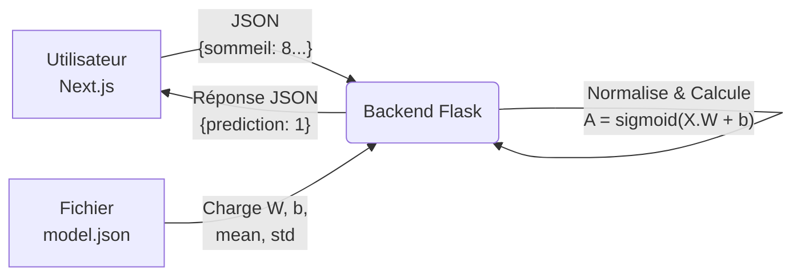

# 🏃 Healthy Lifestyle Predictor

Projet Machine Learning - Régression Logistique from scratch

## 📋 Objectif

Créer une application web qui permet de prédire le mode de vie sain/malsain basée sur 5 habitudes quotidiennes/hebdomadaires.

## 👥 Équipe
- **Member 1**: Abdlatif SIDI MED NABGHA - GLSID2
- **Member 2**: Nejmi Houssam - CCN2
- **Member 3**: SAbih Noha - CCN2 
- **Member 4**: Nawal EL-AARAJ - BDCC2

## 📋 Description
Application de prédiction du mode de vie sain/malsain basée sur 5 habitudes quotidiennes/hebdomadaires (sommeil, activité physique, temps passé à l'écran, consommation d'eau et consommation de fast-food).

## 🛠️ Technologies
- **ML**: Logistic Regression (from scratch)
- **Backend**: Flask
- **Frontend**: Next.js
- **Data**: Python, Pandas, NumPy

## 🏗️ Architecture Technique


## 📁 Structure du Projet
```
healthy-lifestyle-predictor/
│
├── README.md                         ✅ Documentation principale
├── .gitignore                        ✅ Fichiers à ignorer
│
├── data/
│   ├── README.md
│   ├── generate_dataset.py           ✅ Script de génération
│   ├── data_analysis.ipynb           ✅ Notebook d'analyse
│   └── dataset.csv                   ✅ Dataset généré
│
├── model/                   
│   ├── dataset.csv                   ✅ Dataset généré
│   ├── logistic_regression.ipynb     ✅ Notebook d'analyse
│   ├── model.json                    ✅ Modèle généré(stocke les paramètres)
│   └── README.md                     ✅ Documentation
│
├── backend/                 
│   ├── app.py                        ✅ API Flask
│   ├── requirements.txt              ✅ Dépendances
│   └── README.md                     ✅ Documentation
│
├── frontend/
│   ├── app/
│   │   ├── layout.tsx
│   │   ├── page.tsx                    # ✅ Simple et propre
│   │   └── globals.css
│   ├── components/
│   ├── ui/
│   │   ├── ProgressBar.tsx         # ✅ Barre de progression
│   │   ├── StepCard.tsx            # ✅ Carte d'étape
│   │   └── ResultCard.tsx          # ✅ Carte de résultat (verte/rouge)
│   ├── forms/
│   │   └── HealthForm.tsx          # ✅ Orchestrateur principal
│   └── layout/
│   |   └── Container.tsx           # ✅ Container responsive
│   ├── lib/
│   |   ├── api.ts                      # ✅ Appels API
│   |   ├── types.ts                    # ✅ Types TypeScript
│   |   └── constants.ts                # ✅ Configuration des steps
│   ├── hooks/
│   |   └── useHealthPredictor.ts       # ✅ Logique métier
└── package.json    

```

### Description des dossiers
- **`/data`** - Dataset synthétique et visualisations
- **`/model`** - Notebook et implémentation du modèle ML from scratch
- **`/backend`** - API Flask pour les prédictions
- **`/frontend`** - Interface utilisateur Next.js
